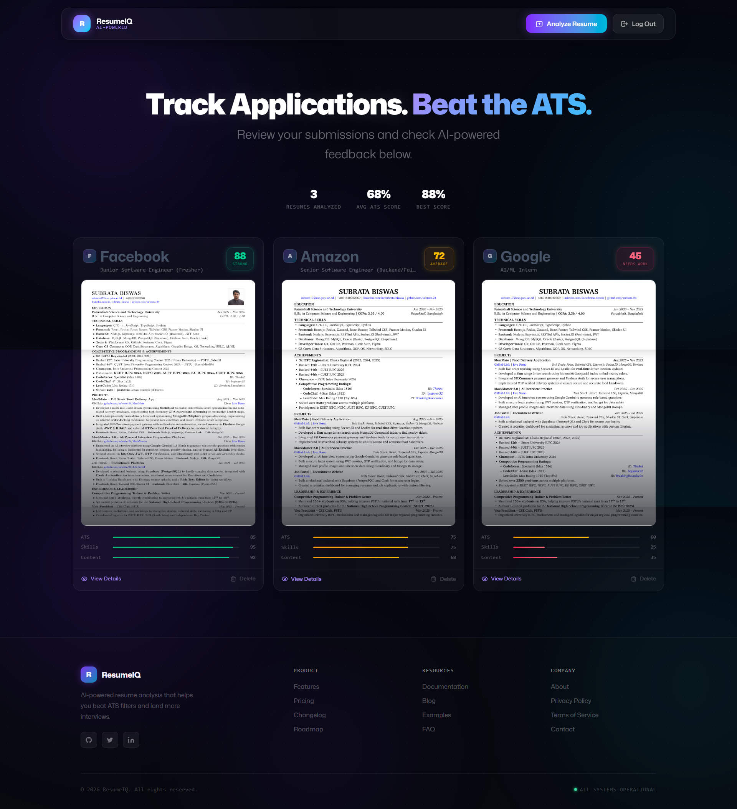
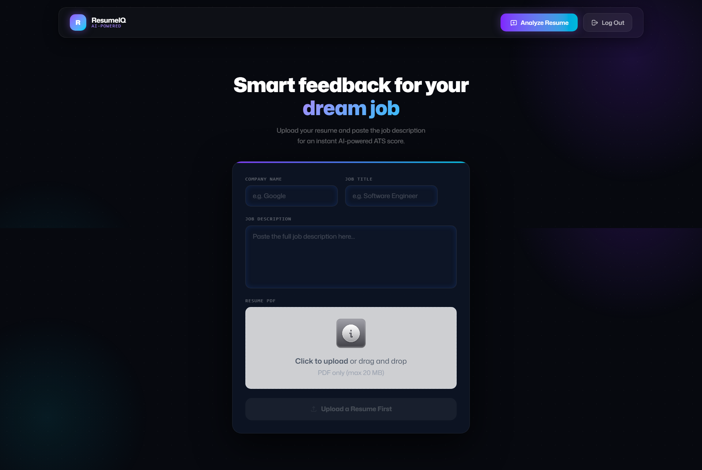
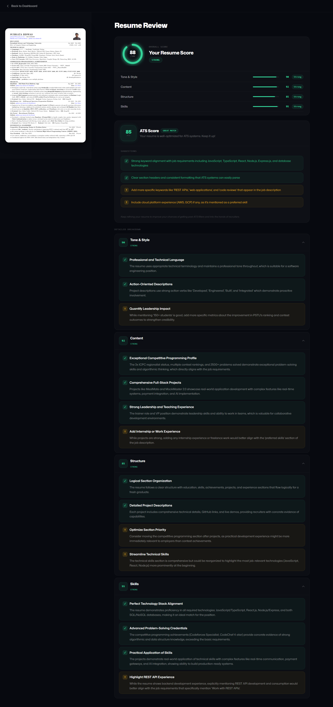

# 🚀 AI Resume Analyzer & ATS Scorer

An intelligent AI-powered Resume Analyzer that evaluates resumes against job descriptions and generates structured ATS scores, detailed feedback, and improvement suggestions.

This application simulates how real-world Applicant Tracking Systems (ATS) evaluate resumes and provides actionable feedback to improve job match probability.

---

## 🌐 Live Demo

👉 **Live Application:** https://puter.com/app/ai-resume-analyzer-173  

---

## 📸 Screenshots

### 🏠 Home Page


### 📤 Resume Upload


### 📊 Detailed Feedback View


---

## ✨ Features

- 🔐 User Authentication (Handled by Puter.js)
- 📄 Resume Upload (PDF/Image Supported)
- 🧠 AI-Powered ATS Analysis
- 📊 Overall Resume Score (0–100)
- 📌 Category-Based Feedback:
  - ATS Compatibility
  - Tone & Style
  - Content Quality
  - Structure
  - Skills Match
- 🗂 Session-Based User Dashboard
- 🖼 Resume Image Preview (Side-by-side Feedback View)
- 🗑 Session Delete Functionality
- ⚡ Real-Time AI Response
- 🎯 Job Description Specific Scoring

---

## 🧠 How It Works

1. User logs in using Puter authentication.
2. Uploads resume (PDF or image format).
3. Provides:
   - Job Title
   - Company Name
   - Job Description
4. AI model analyzes resume against job description.
5. Generates:
   - Overall Score
   - ATS Score
   - Detailed Category Breakdown
   - Improvement Suggestions
6. The analysis is saved as a session in the user dashboard.
7. Users can:
   - View past sessions
   - Revisit detailed feedback
   - Delete sessions anytime

---
## 🏗 Tech Stack

### Frontend
  - React 19
  - TypeScript
  - Tailwind CSS
  - Zustand (State Management)
  - React Router 7
### Backend & Auth
  - Puter.js (Authentication, Session Storage)
  - AI Model
  - Claude Sonnet 4
### File Handling
  - PDF.js
  - React Dropzone

---

## ⚙️ Installation & Setup
  - Clone the repository
  ```
     git clone https://github.com/your-username/resume-analyzer.git
     cd resume-analyzer
  ```
  - Install dependencies
    ```npm install```
  - Run development server
    ```npm run dev```
  - Build for production
    ```npm run build```

---
## 🎯 Use Cases
  - Fresh graduates optimizing resumes
  - MERN stack developers tailoring resumes
  - Job seekers matching resumes to specific job descriptions
  - Improving ATS pass rate before applying
---

